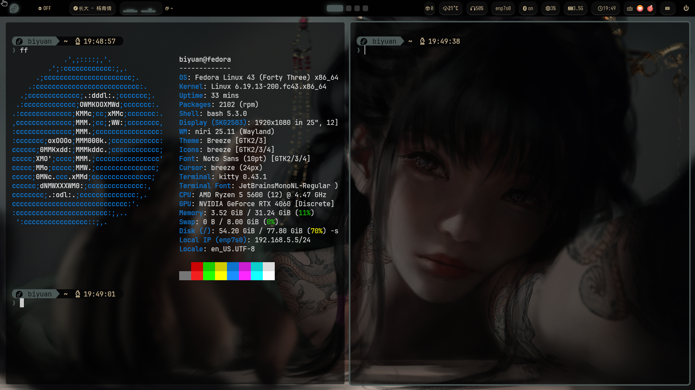

# 概述

- 这是一个为满足自己分享欲并在学习中总结而建立的仓库，当作参考使用，且中内容目的是解决我当前的问题和论坛上看到的一些问题，早期的内容目录结构并不是很完善，文章标题就已经写明了相关问题，方便查看，后续会有所改善。

- 现在主仓库中的是我使用的配置文件，通常适用于最小化安装的 Fedora GNU/Linux 操作系统，主要是 niri，如果有其他桌面环境也可以尝试使用，因为我使用了极简的窗口管理器，暂时会禁用掉你的 Sddm 或者 Gnome 其他的也有 Kde 和 Gnome 可供选择。

- 对于使用 Fedora 新手可以先看一下这一部分[建议](https://github.com/Maomaokuxs/Biyuan-Fedora-Learning/wiki/%E4%BD%BF%E7%94%A8fedora%E7%9A%84%E5%BB%BA%E8%AE%AE)。

- 请前往[wiki](https://github.com/Maomaokuxs/Biyuan-Fedora-Learning/wiki)页面查看。

## 依据

- 基于 《linux 命令行与 shell 脚本编程大全》;
- 基于网络文章；
- 询问 AI 并实践验证，并不是直接复制粘贴到 Wiki。

## 说明

曾经我安装过许多的发行版，我觉得选择发行版确实是一件比较重要的事，我现在已经习惯了使用 Fedora ，最初我都喜欢接受默认，如今倒也开始使用窗口管理器，不知道是不是使用了 Linux 就喜欢简单些，去深究这些功能是怎么实现的，当然我至今依旧是小白，这些脚本是在 AI 的帮助下完成的，由我提出想法经由 AI 去完成，不得不说 Gemini 确实很强，但是 WIKI 中的内容重要的部分是参照其他的帖子然后自己尝试写下的可行方案，如今为了想要体验 niri 的用户分享我的配置文件。

## 桌面环境截图

- niri

