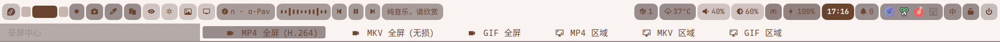
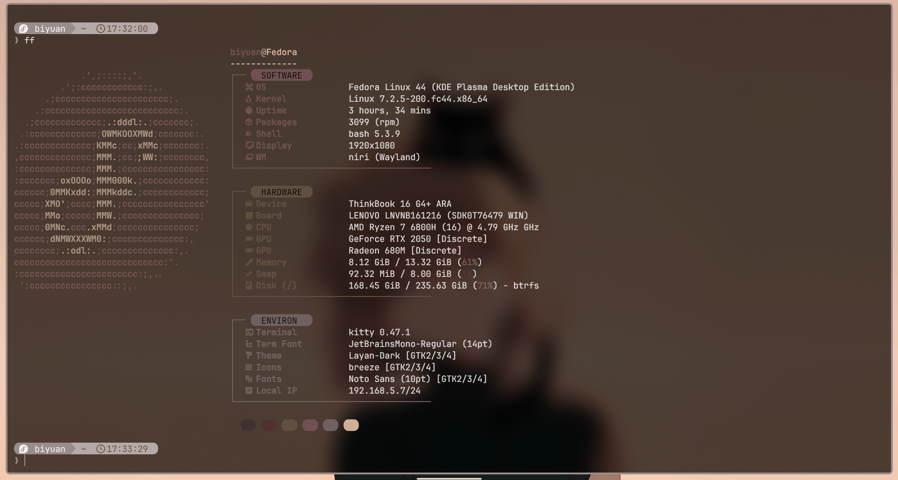

# 配置文件使用说明（从零开始）

## 1. 准备

```bash
git clone https://github.com/Maomaokuxs/Biyuan-Fedora-Learning.git
cd Biyuan-Fedora-Learning
```

## 2. 安装

```bash
chmod +x install.sh
./install.sh
```

1. `Check and pull the latest remote code? (y/n):` → `y` 拉取/`n` 跳过
2. `Create snapper snapshot? (y/n):` → `y` 创建 `Btrfs` 快照/`n` 跳过（仅 `Btrfs`）
3. `Select [1-4 / r / n]:` 选镜像（`1 Tuna`/`2 Aliyun`/`3 USTC`/`4 Cernet`，`r` 恢复官方，`n` 保持）
4. `Install NVIDIA drivers? (y/n):` → `y` 装 `rpmfusion` 显卡驱动/`n` 跳过
5. 后续 `Install niri? (y/n)` / `Install KDE? (y/n)` / `Install Greetd? (y/n)` 等桌面选择均 `y` 安装/`n` 跳过

## 3.使用

1. bar
  
    - 介绍

      bar 我使用了两款，功能大致是相同的，分别是 waybar 和 quickshell，想要启用哪款只要在 niri 配置文件中取消注释，记得只启用一款，以下针对的是我的配置文件说明非软件本身的拉踩。

      waybar：优点是资源占用小，启动速度快，缺点就是动画简单没有那么华丽。

      

      quickshell：优点是扩展丰富，并且本身就支持弹窗，非常的方便，动画更加优雅，缺点是占用比waybar高。

      

    - 使用

      - 隐藏工具栏

      右键点击左侧 Fedora 徽标或电源开关可以隐藏很多小工具，在重启之后不取消隐藏状态。

      

      - 工具

      左侧：录屏，截图，取色，剪贴板，护眼，昼夜切换，壁纸，显示器切换，音乐，音乐可视化，音乐控件，歌词。

      右侧：可更新包数量，天气，声音，亮度，性能模式，电量，历史通知，托盘，键盘中英文指示器，禁止熄屏，电源菜单。

        - 录屏

      

        - 壁纸

      

        - 天气

        需要手动填写地区，这个文件明文保存到本地，不会上传，如果介意可以不填写，他会根据时区及ip地址来获取位置。

        ```bash
        echo "LOCATION=Shanghai" > ~/.config/by-mgr/weather.conf
        ```

2. niri

    - 介绍

    几乎没有修改原有的快捷键，仅仅说明新增和删减的快捷键，可以使用 Mod + Shift + / 打开快捷键提示框。

    - 快捷键

      - Mod + T ：kitty 终端
      - Mod + B ：waypaper 壁纸切换器
      - Mod + D ：rofi 应用启动器
      - Ctrl + Alt + W：随机壁纸
      - Ctrl + Alt + M：音乐控制菜单
      - Ctrl + Alt + P：电源控制菜单
      - Ctrl + Alt + L：hyprland 锁屏
      - Ctrl + Alt + A：录屏
      - Mod  + Ctrl + V：copyq 剪贴板

    - 窗口规则

    具体查看配置文件。

3. rofi-wayland

    - 介绍

    其担任了应用启动器，媒体管理器，电源菜单，屏幕管理器，录屏管理器的功能，不需要过多的介绍，需要使用时会自然弹出，部分组件可看下图。

    

4. kitty、fastfetch 及 starship

    - 介绍

    加上窗口模糊及透明效果，及光标移动动画，starship 美化终端提示符，fastfetch 快速抓取主机信息丰富终端体验，诸如此类还有 btop 资源管理器，nmtui 网络管理器，ncdu 存储管理器等等。

    

5. 壁纸

    - 介绍

    前面提及可以使用快捷键位 Mod + B 调用 waypaper 来切换壁纸，其次是 quickshell 中的壁纸模块切换，如果喜欢随机壁纸可以使用快捷键，Ctrl + Alt + W ，需要着重介绍是因为整个主题会因为壁纸的不同配色发生改变，借助了 waypaper，quickshell，waybar，awww（原swww），kde-material-you-colors 以及仓库中的脚本，可以联动：Niri 边框、Waybar、Rofi、Kitty、Starship、Neovim、Cava、Hyprlock、KDE 、通知（Mako/QuickShell）、Fcitx5 输入法皮肤。

    
